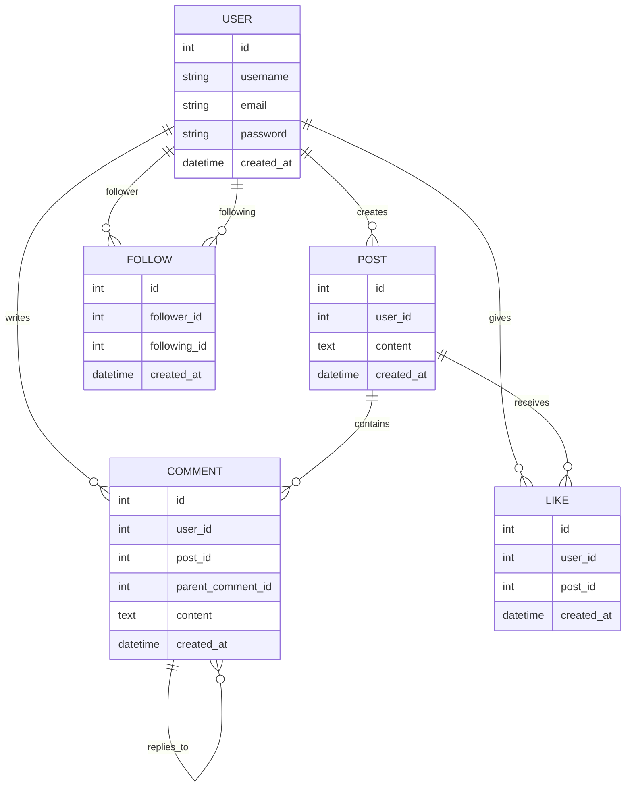

# Entity Relationship Diagram

## Description

The application consists of five main entities:

1. User
2. Post
3. Comment
4. Like
5. Follow

Relationships:

* A User can create multiple Posts.
* A User can create multiple Comments.
* A User can Like multiple Posts.
* A User can Follow multiple Users.
* A Post can have multiple Comments.
* A Post can have multiple Likes.
* A Comment can have child Comments (threaded replies).

## Mermaid ER Diagram

## Future Enhancements

* User Profile
* Notifications
* Search Functionality
* Media Uploads
* Messaging System
* Elasticsearch Integration
* Celery-based Data Export
